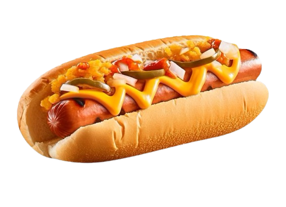

<backgrou

<h1 align="center">E-commerce para empresas de fast food</h1>

Este projeto web tem como objeivo divulgar, facilitar e melhorar o trabalho para atrair mais clientes para redes de fast food. 😉

<h3 style="color: #e4a002">Paleta de cores</h3>
 
<h3>Linguagens utilizadas</h3>
  

<h2>Dentro do site contém </h2>
<table>
  <tr>
    <td align="left">
 <ul class="a">
  <li>Planos e Cadastro de clientes, com verificação de usuário </li> 
<li>Loja de suplementos online</li>
     <li>Noticiário de notícias sobre o ramo fitness </li>
  
</ul>
   
𝑬 𝒎𝒖𝒊𝒕𝒐 𝒎𝒂𝒊𝒔 ...

  </tr>
</table>

